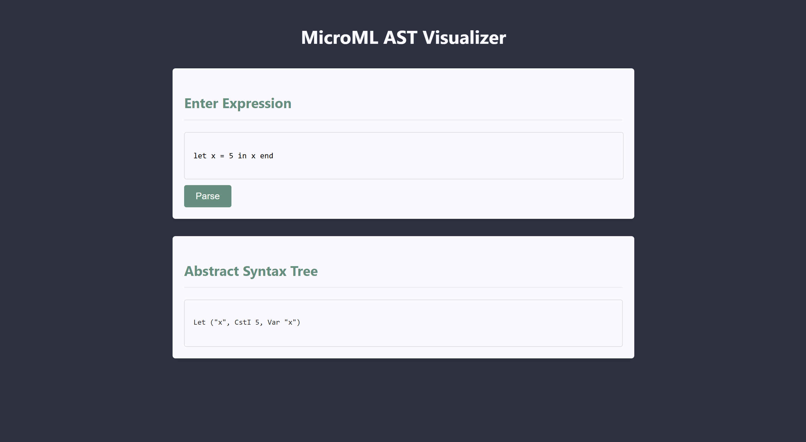

## Introduction
This is a web app that displays the AST for MicroML code, built using F#, .NET, HTML, CSS and JS. It allows the user enter a MicroML expression and in return get the corresponding syntax tree.

## Features
- Take User input: Allows user to enter MicroML expression
- Display AST: Display AST for the entered MicroML expression

  

## Requirements
- .NET SDK 9
- F#
- HTML
- CSS
- JS

## License
This project is licensed under the [MIT License](LICENSE).
